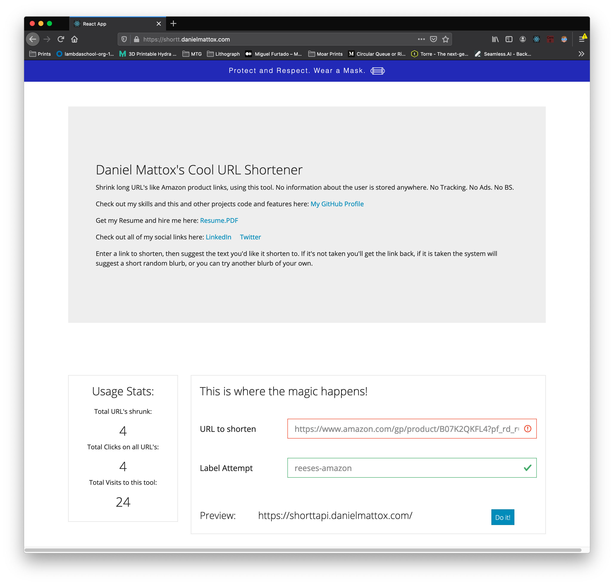

# shortt
A URL shortener, with several cool features

## About this project
Everyone knows what this is, what it does, but unlike a lot of similar projects, I wanted to keep track of how many times a link has been clicked on, and how many times all of the links have been clicked on, as well as how many people have visited, and actually used the tool by comparison. I could have used Google Analytics for most of it, but I don't like google, and so I'll leave that for the workplace, not my personal projects.

### Tech Stack

**Front End**

React -  Because I love it! Combined with react-router-dom to make it an SPA
Axios - API calls
Formik and Yup - Form validation
React-Copy-To-Clipboard - Cool component I found to handle copy the end result link for the user
Reactstrap - Bootstrap layout in React components
Bootswatch - All the sexy styling

**Back End**

Express - All the routes
Express-Brute - This is my new boucer, Eb, he'll be in all of my projects from now on preventing abuse!
LowDB - Flat file DB for a single value, visits to the page
Nano-ID - Cool little unique ID generator. I usually use CUID but didn't need as much salty randomness in this project

#### Todo
I was trying to have it show the top three most clicked links, by having the server crawl the site at the long (original) URL, and store that site's title in the DB with the rest of the entry, but I was getting mixed results, so I hope to revisit that in the future.

##### Screenshots

This project is hosted on my private server [HERE CLICK ME!](https://shortt.danielmattox.com)